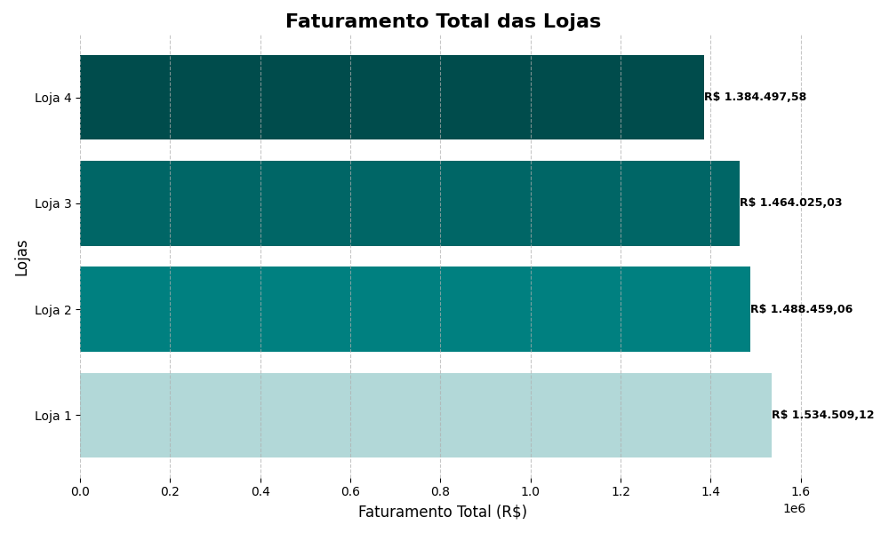

# 📊 Análise Estratégica de Vendas e Logística da AluraStore

[](https://opensource.org/licenses/MIT)
[](https://www.python.org/downloads/)
[](README.md#dependencias)
[](README.md)
[](https://colab.research.google.com/github/Degles/challenger_alura_store_BR/blob/main/notebooks/AluraStoreBrFinal.ipynb)

Este repositório contém um projeto abrangente de análise de dados com foco no desempenho de vendas de múltiplas lojas e no impacto do custo do frete, utilizando dados da AluraStore. O objetivo é fornecer insights claros e acionáveis para otimização de operações e melhoria da lucratividade.

---

## 📖 Tabela de Conteúdos

* [🎯 Propósito da Análise e Funcionalidades](#-proposito-da-analise-e-funcionalidades)
* [📁 Estrutura do Projeto](#-estrutura-do-projeto)
* [🚀 Como Começar e Executar o Notebook](#-como-comecar-e-executar-o-notebook)
    * [Pré-requisitos](#pré-requisitos)
    * [Instalação](#instalação)
    * [Carregamento dos Dados (URLs e Fallback Local)](#carregamento-dos-dados-urls-e-fallback-local)
    * [Executando o Notebook](#executando-o-notebook)
* [📊 Insights Chave e Visualizações Principais](#-insights-chave-e-visualizacoes-principais)
    * [Desempenho Geral das Lojas](#-desempenho-geral-das-lojas)
    * [Análise Temporal de Faturamento](#-analise-temporal-de-faturamento)
    * [Padrões de Venda por Dia da Semana](#-padroes-de-venda-por-dia-da-semana)
    * [Comparativo de Faturamento Mensal Anual](#-comparativo-de-faturamento-mensal-anual)
    * [Análise de Custo de Frete e Localização](#-analise-de-custo-de-frete-e-localizacao)
* [🤔 Análise para Encerramento de Operação de Loja](#-analise-para-encerramento-de-operacao-de-loja)
* [⚙️ Dependências](#-dependencias)
* [🤝 Como Contribuir](#-como-contribuir)
* [📄 Licença](#-licenca)
* [📧 Contato](#-contato)

---

## 🎯 Propósito da Análise e Funcionalidades

Este projeto visa aprofundar o entendimento sobre as operações de vendas da AluraStore, com foco em:

* **Consolidação e Pré-processamento de Dados:** Unificar dados de vendas de múltiplas lojas para uma análise integrada e robusta.
* **Avaliação de Desempenho por Loja:** Analisar faturamento total, volume de vendas, ticket médio e avaliação de compra para cada unidade.
* **Identificação de Produtos Chave:** Determinar os produtos de maior e menor desempenho.
* **Impacto e Fatores do Frete:** Quantificar a participação do frete no faturamento, e investigar sua correlação com a loja, categoria de produto e localização geográfica.
* **Análise Temporal de Vendas:** Identificar tendências, sazonalidades (mensal, trimestral, anual) e padrões de vendas por dia da semana.
* **Geração de Insights Acionáveis:** Fornecer recomendações estratégicas para otimização logística, ajustes de precificação e melhoria de desempenho operacional.

---

## 📁 Estrutura do Projeto

A organização do repositório foi pensada para clareza e fácil navegação:

```

.
├── data/
│   └── raw/                    \# Contém os arquivos CSV brutos para fallback (NÃO versionado no Git)
│       ├── loja\_1.csv
│       ├── loja\_2.csv
│       └── ... (outros CSVs)
├── notebooks/
│   └── AluraStoreBrFinal.ipynb \# O notebook principal com toda a análise, desde o carregamento dos dados até as visualizações e insights.
├── imagens/                    \# Armazena os gráficos gerados pelo notebook para fácil visualização no README.
│   ├── faturamento\_por\_lojas\_grafico.png
│   ├── faturamento\_temporal\_global\_e\_por\_loja\_grafico.png
│   ├── vendas\_por\_dia\_semana\_grafico.png
│   ├── faturamento\_mensal\_comparativo\_anual\_grafico.png
│   ├── custo\_frete\_scatter\_plot.png (Exemplo - se seu notebook gera)
│   └── mapa\_interativo\_frete\_screenshot.png (Exemplo - se seu notebook gera)
├── .gitignore                  \# Define quais arquivos e pastas o Git deve ignorar (ex: 'data/')
└── README.md                   \# Este arquivo, com a descrição detalhada do projeto e instruções.

````

---

## 🚀 Como Começar e Executar o Notebook

Para replicar a análise e explorar os resultados:

### Pré-requisitos

Certifique-se de ter o Python 3.x instalado em seu sistema. É altamente recomendável usar um **ambiente virtual** para gerenciar as dependências do projeto.

* Python 3.11+
* `pip` (gerenciador de pacotes do Python)

### Instalação

1.  **Clone o repositório:**
    ```bash
    git clone [https://github.com/Degles/challenger_alura_store_BR.git](https://github.com/Degles/challenger_alura_store_BR.git)
    cd challenger_alura_store_BR
    ```

2.  **Crie e ative um ambiente virtual:**
    * **Windows (PowerShell):**
        ```bash
        python -m venv .venv
        .\.venv\Scripts\Activate.ps1
        # Se ocorrer erro de política de execução: Set-ExecutionPolicy -ExecutionPolicy RemoteSigned -Scope CurrentUser
        ```
    * **Linux / macOS / Git Bash (Windows):**
        ```bash
        python3 -m venv .venv
        source ./.venv/bin/activate
        ```

3.  **Instale as dependências:**
    ```bash
    pip install -r requirements.txt
    ```
    *(Caso não tenha um `requirements.txt`, instale as bibliotecas individualmente: `pip install pandas matplotlib requests folium csv`)*

### Carregamento dos Dados (URLs e Fallback Local)

* Este notebook tenta carregar os dados CSV diretamente de **URLs do GitHub** (fonte primária).
* **Lógica de Fallback Robusta:** Se as URLs estiverem temporariamente inativas (ex: erro `429 Too Many Requests`), o notebook está configurado com uma **lógica de fallback**: ele tentará carregar os dados de arquivos CSV locais.
* **Para habilitar o fallback local (se as URLs falharem para você):**
    1.  Crie a pasta `data/raw/` na **raiz** do seu projeto (`challenger_alura_store_BR/data/raw/`).
    2.  Baixe manualmente os arquivos CSV originais para essa pasta `data/raw/`:
        * [loja_1.csv](https://raw.githubusercontent.com/alura-es-cursos/challenge1-data-science/refs/heads/main/base-de-dados-challenge-1/loja_1.csv)
        * [loja_2.csv](https://raw.githubusercontent.com/alura-es-cursos/challenge1-data-science/refs/heads/main/base-de-dados-challenge-1/loja_2.csv)
        * [loja_3.csv](https://raw.githubusercontent.com/alura-es-cursos/challenge1-data-science/refs/heads/main/base-de-dados-challenge-1/loja_3.csv)
        * [loja_4.csv](https://raw.githubusercontent.com/alura-es-cursos/challenge1-data-science/refs/heads/main/base-de-dados-challenge-1/loja_4.csv)
    *(**Importante:** A pasta `data/` está no `.gitignore` e não é versionada no GitHub para manter o projeto leve.)*

### Executando o Notebook

1.  **Abra o Notebook:**
    * **No Google Colab:** Clique no badge "Open in Colab" no topo deste README ou acesse o Colab e abra o notebook via GitHub.
    * **No VS Code:** Abra a pasta do projeto e, em seguida, o arquivo `notebooks/AluraStoreBrFinal.ipynb`.

2.  **Execute as Células:** Execute cada célula sequencialmente, clicando no ícone de "Play" (triângulo) ou pressionando `Shift + Enter`. Observe os outputs e gráficos.

---

## 📊 Insights Chave e Visualizações Principais

O `AluraStoreBrFinal.ipynb` gera relatórios e gráficos que transformam dados em insights acionáveis.

### 📈 Desempenho Geral das Lojas

Uma visão rápida do faturamento total por loja, permitindo identificar as unidades com melhor e pior desempenho.


*Gráfico de Faturamento Total por Loja.*

---

### ⏰ Análise Temporal de Faturamento

Gráficos detalhados que mostram as tendências de faturamento ao longo do tempo (mensal, trimestral, anual), tanto globalmente quanto por loja, revelando sazonalidades e padrões de crescimento.


*Faturamento Mensal Global, Trimestral Global e Mensal por Loja.*

---

### 📅 Padrões de Venda por Dia da Semana

Este gráfico revela os dias da semana com maior volume de vendas, essencial para otimização de equipes e campanhas de marketing.

**Observação:** A análise de "vendas por hora do dia" foi removida e não é exibida, pois os dados fornecidos não contêm informações de tempo (horas, minutos) nas datas de compra.


*Volume de Vendas Agregado por Dia da Semana.*

---

### 📈 Comparativo de Faturamento Mensal Anual

Um gráfico comparativo que permite analisar o faturamento mensal ao longo de diferentes anos, destacando a evolução da performance.


*Comparação do Faturamento Mensal ao longo dos anos.*

---

### 💰 Análise de Custo de Frete e Localização

Esta seção aborda a participação do frete no faturamento global, o custo médio por loja e por categoria de produto. Pode incluir visualizações como scatter plots e mapas interativos (salvos como HTML).

* **Insight:** A análise revela que o **custo total de frete de R$ 312.930,66 representa 5,33% do faturamento global**, exigindo atenção. Categorias como **Eletrodomésticos (R$ 81,69)** e regiões como **Roraima (RR, R$ 113,67)** e **Acre (AC, R$ 49,36)** apresentam fretes significativamente mais caros, indicando desafios logísticos e oportunidades de otimização.

*(**Observação:** Se o seu notebook gera imagens específicas para o frete, adicione-as aqui. Ex: `` ou ``)*
*(Se gerar HTML, pode mencionar: `O mapa interativo de frete é gerado como um arquivo HTML e pode ser aberto diretamente no navegador para interação completa.`)*

---

## 🤔 Análise para Encerramento de Operação de Loja

Com base nas análises apresentadas no relatório, **não há dados suficientes para justificar o encerramento da operação de nenhuma loja neste momento**. A decisão de encerrar uma loja deve considerar métricas financeiras mais abrangentes e uma análise holística.

### Justificativa Detalhada:

* **Marginalidade do Frete:** As diferenças nos custos de frete médio entre as lojas são **mínimas**, não sendo um fator decisivo isolado.
* **Lacuna em Métricas Financeiras:** Faltam dados cruciais como lucro líquido por loja, volume de clientes e potencial de crescimento para uma avaliação completa.
* **Necessidade de Análise Holística:** Decisões de fechamento exigem uma visão 360º de fatores financeiros, operacionais e estratégicos.

---

## ⚙️ Dependências

Para executar o notebook, as seguintes bibliotecas Python são necessárias:

* `pandas`
* `matplotlib`
* `requests`
* `folium`
* `csv` (módulo padrão do Python)
* `io` (módulo padrão do Python)
* `os` (módulo padrão do Python)

Você pode instalar as bibliotecas externas usando `pip`:
`pip install pandas matplotlib requests folium`

---

## 🤝 Como Contribuir

Contribuições são muito bem-vindas! Se você tiver sugestões, melhorias ou encontrar algum problema, sinta-se à vontade para:

1.  Abrir uma [Issue](https://github.com/Degles/challenger_alura_store_BR/issues) para relatar bugs ou sugerir novas funcionalidades.
2.  Criar um [Pull Request](https://github.com/Degles/challenger_alura_store_BR/pulls) com suas modificações.

---

## 📄 Licença

Este projeto está licenciado sob a Licença MIT. Consulte o arquivo [LICENSE](LICENSE) para mais detalhes.

---

## 📧 Contato

* **Seu Nome/Pseudônimo:** Degles Siqueira
* **Email:** degles@gmail.com
* **LinkedIn (Opcional):** [https://www.linkedin.com/in/degles-siqueira/](https://www.linkedin.com/in/degles-siqueira/)
* **GitHub:** [https://github.com/Degles](https://github.com/Degles)

---

**© 2025 Degles Siqueira**

---
````
